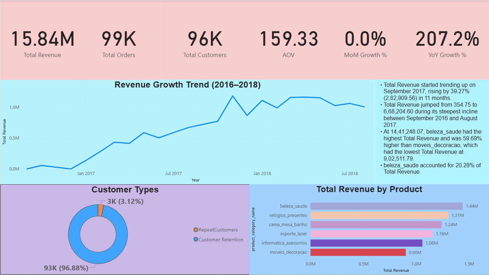
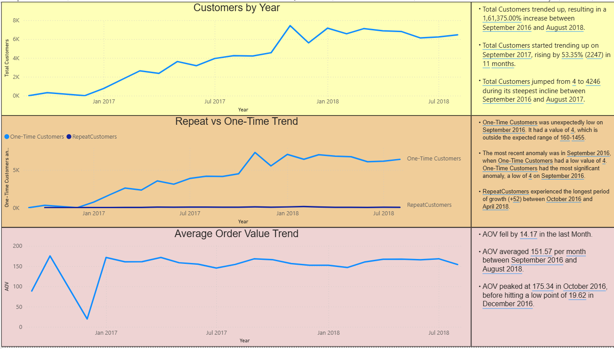

# 📊 E-Commerce Sales Analytics Dashboard (Power BI + SQL)

## 🚀 Project Summary

An end-to-end Business Intelligence project analyzing Brazilian E-Commerce data (2016–2018) to uncover revenue trends, customer behavior patterns, and product performance insights.

This project demonstrates:

- SQL-based data extraction (PostgreSQL)
- Data modeling & star schema design
- Advanced DAX measures (Time Intelligence)
- Business KPI development
- Interactive dashboard storytelling

---

## 🧠 Business Problem

The company wants to:

- Understand revenue growth trends
- Identify customer retention issues
- Analyze top-performing product categories
- Measure key KPIs for executive decision-making

The goal was to transform raw transactional data into actionable business insights.

---

## 🛠 Tech Stack

| Tool | Purpose |
|------|---------|
| PostgreSQL | Data extraction & querying |
| Power BI | Dashboard development |
| DAX | KPI & time intelligence calculations |
| Data Modeling | Star schema implementation |
| Git + Git LFS | Version control for large PBIX file |

---

## 🏗 Data Model Architecture

A star schema was implemented for optimized performance and accurate time intelligence.

**Fact Table:**
- `order_items`

**Dimension Tables:**
- `orders`
- `customers`
- `products`
- `date`

Relationships were carefully defined to ensure:
- Accurate revenue aggregation
- Proper filter propagation
- Correct time-based analysis

---

## 📈 Dashboard Structure (3 Pages)

### 🔹 1. Executive Summary

- Total Revenue
- Total Orders
- Total Customers
- Average Order Value (AOV)
- Month-over-Month Growth %
- Year-over-Year Growth %
- Revenue Trend (2016–2018)

📌 Purpose: Executive-level KPI overview

---

### 🔹 2. Customer Analysis

- Repeat vs One-Time Customer Distribution
- Customer Growth Trend
- Average Order Value Trend
- Retention Insight Metrics

📌 Key Insight:
> 96.8% of customers were one-time buyers, highlighting a major retention opportunity.

---

### 🔹 3. Product Analysis

- Revenue by Product Category
- Top 10 Revenue-Generating Products
- Monthly Revenue Trend by Category
- Category Performance Comparison

📌 Key Insight:
Top categories driving revenue:
- Beauty & Health
- Watches
- Furniture

---

## 📊 Key DAX Measures

```DAX
Total Revenue = SUM('public order_items'[price])

Total Orders = DISTINCTCOUNT('public orders'[order_id])

Total Customers = DISTINCTCOUNT('public customers'[customer_unique_id])

AOV = DIVIDE([Total Revenue], [Total Orders])

MoM Growth % =
VAR PrevMonth =
    CALCULATE([Total Revenue], DATEADD('Date'[Date], -1, MONTH))
RETURN
DIVIDE([Total Revenue] - PrevMonth, PrevMonth)

YoY Growth % =
VAR PrevYear =
    CALCULATE([Total Revenue], SAMEPERIODLASTYEAR('Date'[Date]))
RETURN
DIVIDE([Total Revenue] - PrevYear, PrevYear)
```

---

## 📌 Business Insights Derived

- Revenue showed steady growth between 2016–2018.
- High dependency on new customers rather than repeat buyers.
- A small number of categories contribute majority of revenue (Pareto effect observed).
- Customer retention improvement could significantly increase lifetime value.

---

## 📷 Dashboard Preview




---

## 🎯 What This Project Demonstrates

✔ SQL proficiency (joins, aggregation, grouping)

✔ Data cleaning & structured modeling

✔ Star schema implementation

✔ Advanced DAX (time intelligence)

✔ KPI development for business stakeholders

✔ Dashboard design & storytelling

✔ Version control using Git LFS

---

## 📂 Repository Structure

```structure
powerbi-ecommerce-sales-dashboard/
│
├── Ecommerce_Sales_Dashboard.pbix
├── README.md
├── screenshots/
│   ├── executive_summary.png
│   ├── customer_analysis.png
│   └── product_analysis.png
└──dats/
    └──ecommerce_sales_dataset_by_olist.zip
```

---

## 👨‍💼 Author

**Manas Shukla**

_Aspiring Data Analyst | Data Scientist
Skilled in SQL, Power BI, Machine Learning & Business Analytics_

---

## 🌐 Socials:
[](https://manas-shukla-portfolio.framer.website/) [](https://instagram.com/manas_shukla_101) [](https://linkedin.com/in/manas-shukla-006774370) [](mailto:shuklamanas8928@gmail.com)
